# Course Review Session

> Author: Naiyi Zhang & Yunke Nie
>
> Course Link: https://johnguerra.co/classes/webDevelopment_fall_2023/
> 
> Design Document: https://github.com/Tiffanyxk3/CourseReviewSession/blob/main/docs/DesignDocument_Project3_CS5610.pdf
> 
> Deployment: 
> 
> Demo Video: 

## Project Objective

### Description
A dynamic online platform designed for collaborative learning and knowledge sharing through review sessions. This web application empowers session initiators to post, edit, and delete session content while facilitating user participation. All users have the ability to join and leave sessions using a unique session id.

## Functionalities
1. Account Management: signing up, logging in, logging out, editing profile, deleting account
2. Session Management: creating new sessions, editing existing sessions, deleting sessions
4. User & Session Interaction: browsing all available sessions, searching for sessions, joining sessions, quiting sessions

## Design

### Color Palette
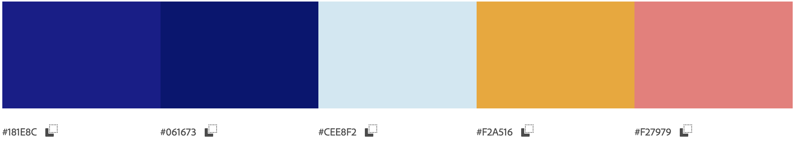
We've refreshed our website with a cleaner and more user-friendly design. Inspired by the background image on our home page, we opted for a light blue hue as the overall background color, providing a serene and inviting atmosphere. The navigation bars and text elements now boast a sophisticated dark blue, enhancing readability and visual appeal. To infuse vibrancy and create focal points, we've introduced a lively orange color for our buttons, adding a touch of excitement to the overall user experience. This thoughtful color palette overhaul aims to maintain clarity, simplicity, and a fresh look for our visitors.

### Fonts
We have employed the Lato font throughout our webpage, enhancing text readability while infusing a sense of vitality into the overall design.

## Screenshots
Login Page:<br>
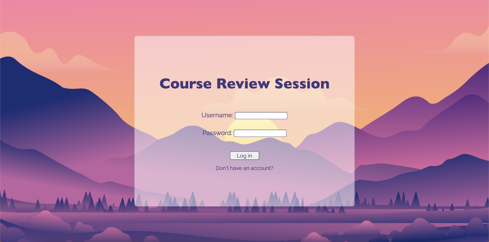 -> <br>
Registration Page:<br>
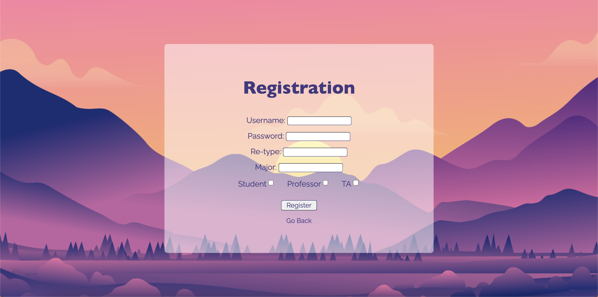 -> <br>
Profile Page:<br>
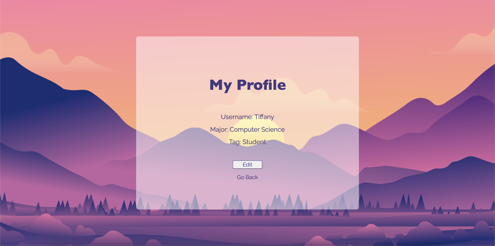 -> 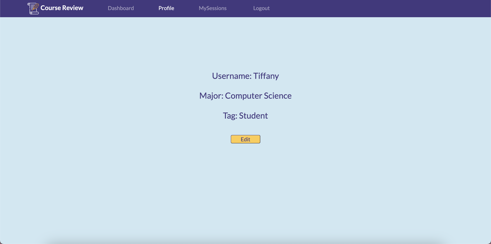<br>
Edit Profile Page:<br>
 -> 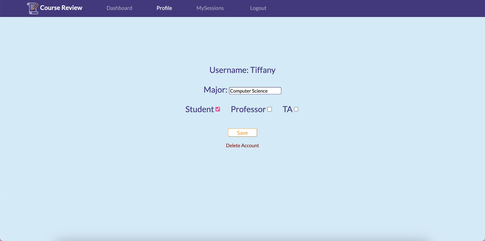<br>
Dashboard Page:<br>
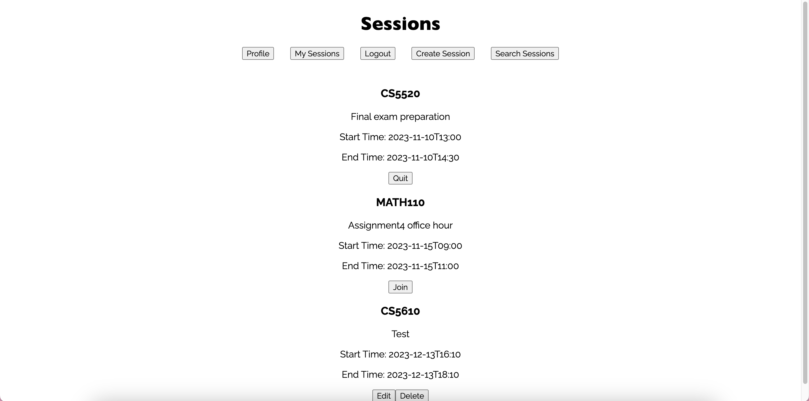 -> 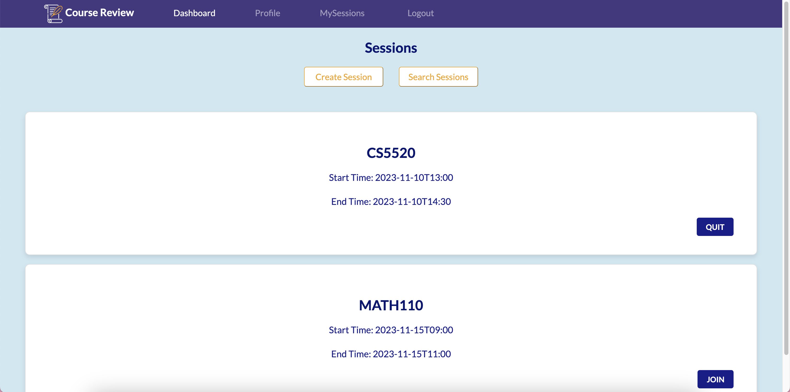<br>
My Sessions Page:<br>
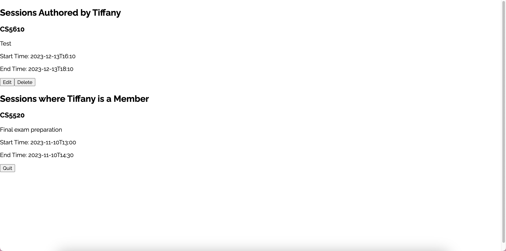 -> 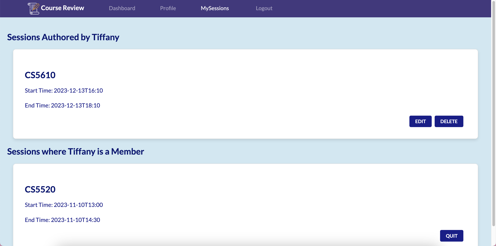<br>
Session Management Page:<br>
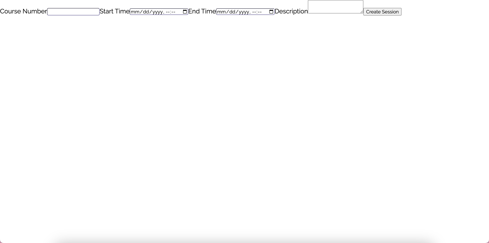 -> 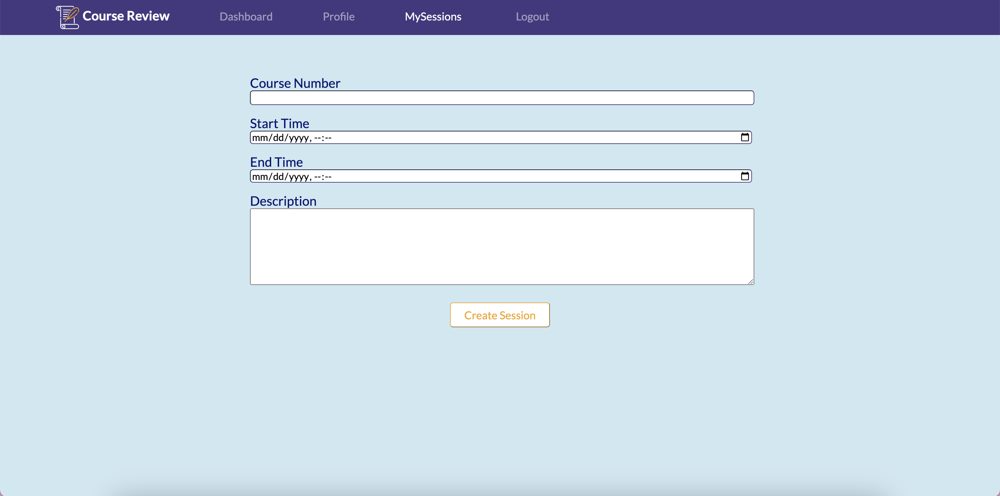<br>

## Usage

### Technology & Framework

- JavaScript
- React, HTML, CSS, AJAX
- Node, Express
- MongoDB, Passport.js
- Nodemon, ESlint, Prettier

After cloning the repository, run the following commands in the root directory of the project:

```
cd front
npm install
npm run build
cd ..
npm install
npm start
```
